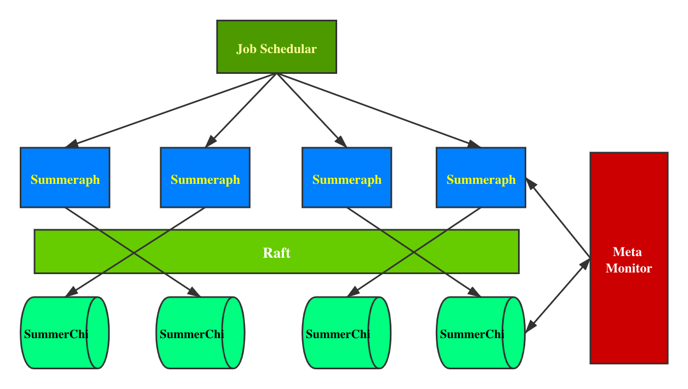

# SummerBase: The Next-Generation Graph Analytic Platform
## Introduction

SummerBase is a new kind of Graph Analytic Platform, combined with OLTP and OLAP processing. The idea is mainly from three top papers:

1. Pregel: A System for Large-Scale Graph Processing;
2. PowerGraph: Distributed Graph-Parallel Computation on Natural Graphs;
3. GraphChi:  Large-Scale Graph Computation on Just a PC;

**Our objective is to integrate Graph Computation and Graph Storage in one system**. We design in **share-nothing distributed framework**. However, GraphChi is initially designed as a single-machine system but it is scalable. So we decide to extend it. 

### Design

#### Framework

SummerBase's framework has two layers. It is computation-storage separated:  

The top layer is **a stateless system**, it is responsible for all in-memory calculation. But we apply a different concurrency model compared with other systems: **Actor**. We take any vertex as an actor, each pair of actor can only mutate state by communication. It comes from Google's *Pregel* paper. However, we should take care of the real-world graph which is skewed of power-law distribution. We construct our top execution models like CMU's *PowerGraph* GAS model. We also use Edge-Cut and Vertex-Cut as default Graph Partition Algorithms.

The secondary layer is a **disk-based system**. Our goal is to integrate all in one. Although we have some valuable theories and projects in distributed RDBMS, it is still a hard problem for Graph DB because Graph Storage and Graph Computation has little common points: 

* Graph Computation usually iterates on a batch of vertices and edges. **It focuses on how to do global analysis on a static, big graph more efficiently**. We need a powerful computation engine;
* Graph Storage usually only query, delete, update and add several vertices and edges. **It focuses on how to CRUD vertex/edge more efficiently**. Concurrency plays a key role.
* The data formats of Graph Computation and Graph Storage are totally different. Transformation is a huge time-consuming task which will affect performance a lot. 

Graph Processing System faces **three challenges** before:

* Most Graph Computation Systems are **in-memory** which means for a large graph, it will consume many resources; Disk-Base system is need now;
* It is not right just put a logic layer on the top of RDBMS or HDFS because degree distribution in real-world is skewed of power-law. We should consider in a native roadmap because it is more efficient and natural.
* Native graph will **face significant random I/O**. How to reduce random I/O is the first problem should be tackled down. 

All these challenges drive us to find a new framework to resolve this problem. Our solution is to **store data in hybrid**. That means, we will **use two different data formats for OLAP and OLTP** tasks respectively. 

* For OLAP, more compact data format is needed;
* For OLTP, we need structural data format;

For OLTP, we have some excellent open-source solutions like [**DGraph**](https://github.com/dgraph-io/dgraph). The basic idea is to use LSM-tree K/V store as backend to reduce random I/O and provide horizontal scalability. We have a top solution in this field: [**RocksDB**](https://github.com/facebook/rocksdb/) and it has mature Rust-wrapped client lib ([tikv/rust-rocksdb](https://github.com/tikv/rust-rocksdb) and [rust-rocksdb](https://github.com/rust-rocksdb/rust-rocksdb)). So we just 'copy their homework'. 

For OLAP, it is **one of the most important job** in this project. Our works (and future works) are as follows:

* We rewrite GraphChi in Rust and provide related programming model.
* We integrate RocksDB backend with GraphChi in a minimum cost way.
* We extend GraphChi into distributed form.
* We use **Raft** as consensus algorithm.

So, we use two different engine and integrate them in one system to work as store backend. But a new question: How to decide a task is OLTP or OLAP automatically?

I think It should be handled by a system like Job Scheduler. Importantly, user-interfaces should make a clear definition that such a task is OLAP or OLTP. **It's not included in my backlog and will be considered in the future**. 

### Framework

### Features

1. Distributed Native Graph Storage with horizontal scalability, HA and ACID. 
2. Support Distributed Large-Scale Graph Computation.
3. Provide GAS-like Programming API.
4. Support Gremlin (TODO).  
5. Support standard GraphQL (TODO).  

## Status

#### Tech Design

- [x] Framework Design

- [x] Data Format Design

- [ ] Data Structure Transformation between SummerChi and Summeraph Design

- [ ] High Level API Design

#### SummerChi

- [x] GraphChi Components reimplementation in Rust
- [ ] GraphChi Persist Storage Engine reimplement in Rust
- [ ] Parallel Slide Windows
- [ ] GraphChi's Programming Model
- [ ] Native graph storage with RocksDB backend
- [ ] Unified Client RPC API and data structure
- [ ] Extend in distributed form
- [ ] Sync and Async Replica

#### Summeraph

- [ ] Components hash algorithm
- [ ] Vertices Actor Model
- [ ] Vertex Pool and Edge Pool model
- [ ] Message Interfaces
- [ ] Communication Dispatcher
- [ ] Data Structure Transformation with SummerChi
- [ ] GAS RPC API

#### Meta Monitor

- [ ] Key-Value status store.
- [ ] Configuration monitor.
- [ ] Node's status monitor.
- [ ] Client RPC API. 
- [ ] Procedural Macro support.

## Quick Start

